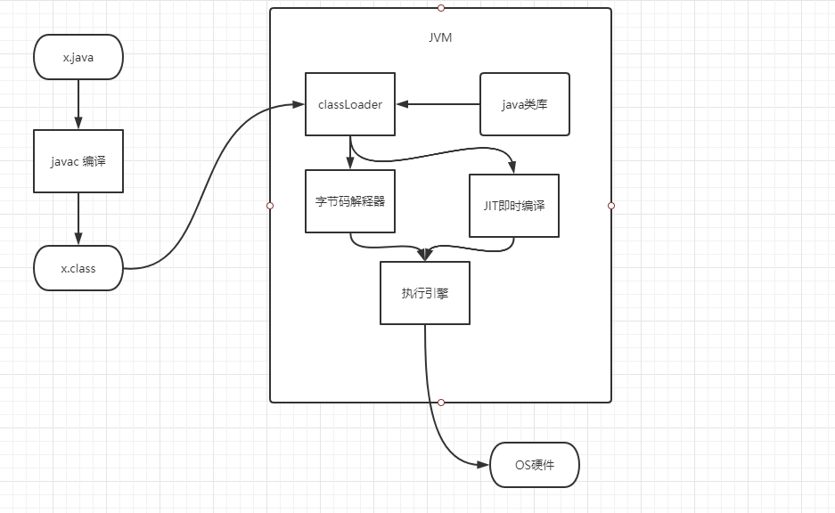

<!-- TOC -->
- [虚拟机概念](#虚拟机概念)
- [class文件结构](#class文件结构)
- [内存加载过程](#内存加载过程)
- [运行时的内存结构](#运行时的内存结构)
- [jvm常用指令](#jvm常用指令) 
- [GC与调优（重点）](#GC与调优（重点）)
<!-- /TOC -->


# 虚拟机概念
- java 虚拟机和java语言无关， 是一个规范。
- java 从编译到执行

```
解释和编译，混合执行，类似C语言在windows上执行时，会把程序编译成exe。省下解释过程
```
- jvm 和java 无关
任何语言 -> class -> jvm , class = 中文（中国范围内）
- 虚构出来的一台计算机 
- 字节码指令集
- 内存管理
- （oracle 官网上有虚拟机文档） 虚拟机规范文档， java语言文档

-- javac 的编译过程？ 汇编相关，以后可以玩

# class文件结构
Specification

[java 语言规范](https://docs.oracle.com/javase/specs/jls/se15/html/index.html)

[java 虚拟机规范](https://docs.oracle.com/javase/specs/jvms/se8/html/index.html)

- bytecode 二进制字节流
- 数据类型 u1,u2,u4,u8 u8代表8个字节
- 查看16进制格式的bytecode 阅读工具 
 - sublime,
 - idea 插件 BinEd  可以直接修改,jclasslib
 - javap -l
 -  
- classFile 构成      The class File Format 
   
```
ClassFile {
    u4             magic;   //魔数
    u2             minor_version;  // 小版本
    u2             major_version;  // 大版本  1.8 34
    u2             constant_pool_count;  //
    cp_info        constant_pool[constant_pool_count-1];   // 主要内容,
    u2             access_flags;  // 按位与
    u2             this_class;
    u2             super_class;
    u2             interfaces_count;
    u2             interfaces[interfaces_count];
    u2             fields_count;
    field_info     fields[fields_count];
    u2             methods_count;
    method_info    methods[methods_count];
    u2             attributes_count;
    attribute_info attributes[attributes_count];
}

```
- 字节码对应 jvm 的汇编指令   
- 由简至繁 一点一点加内容然后读取，变量方法，静态变量,构造方法
- Writes and reads of volatile long and double values are always atomic.

# 内存加载过程
[类加载过程](./calssLoader/classLoader.md)
# 运行时的内存结构
JMM java内存模型
# jvm常用指令
8个原子指令
# GC与调优（重点）


