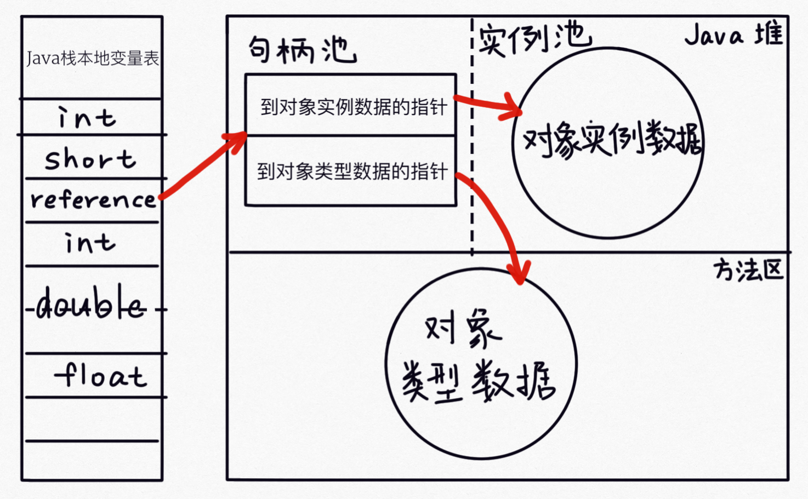
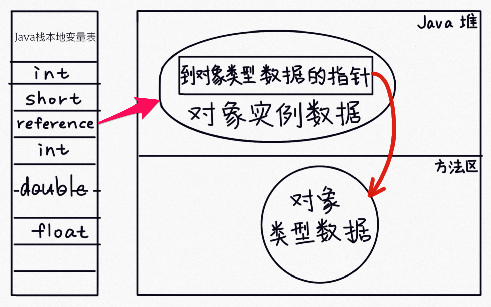

# 关于 Object o = new Object()

## 1.请解释对象的创建过程（半初始化）
```java
public class newObject {
    int m= 8;
    public static void main(String[] args) {
        Object o = new newObject();
    }
}
```
汇编码
```
0 new #2 <java/lang/Object>  // 在内存中申请空间  m= 0,半初始化状态 类比 c语言 malloc+初始化
3 dup  //Duplicate the top operand stack value
4 invokespecial #1 <java/lang/Object.<init>>  // 调用构造方法， m= 8 ，指令重排
7 astore_1  // 将变量o 和内存空间关联 //  指令重排
8 return
```

## 2、DCL单例（Double Check Lock） 到底需不需要volatile ?

### 单例 singleTon是什么,内存中只能存在一个对象/ static
- 单例中为什么会有 double check lock 写法? 
    - lazy-load 
    - 并发问题
    - lock1 为了提高效率
    - 
### volatile语义
- 线程间可见
- 禁止指令重排序
- volatile 修饰变量保证原子性，虚拟机规范要求 总线锁->MESI—> CPU缓存一致性
### DCL 单例，需要volatile 的原因 
o = new Object() 不是原子性的, 可能使用半初始化对象
- （汇编指令只有8个是原子性的  JMM模型，8个原子指令）
    - read
    - write
    - load
    - store
    - 

## 3、对象在内存中的存储结构布局 （JOL 查看内存布局）
- 对象头：
    - 第一部分：存储对象自身运行时的数据，HashCode、GC分代年龄等（Mark Word）；
    - 第二部分：类型指针，指向它的类元数据的指针，虚拟机通过这个指针来判断这个对象是哪个类的实例（HotSpot 采用的是直接指针的方式访问对象的）；
    - 如果是个数组对象，对象头中还有一块用于记录数组长度的数据。
- 实例数据：
    - 默认分配顺序：longs/doubles、ints、shorts/chars、bytes/booleans、oops (Ordinary Object Pointers)，相同宽度的字段会被分配在一起，除了 oops，其他的长度由长到短；
    - 默认分配顺序下，父类字段会被分配在子类字段前面。
 
*注：HotSpot VM要求对象的起始地址必须是8字节的整数倍，所以不够要补齐。*


## 4、对象头包括什么？
- **对象头包括:**
    - mark word:
        - 锁信息 
        - GC信息 age
        - hashCode
    - Class pointers
- 锁信息
```
com.xli.study.singleton.newObjectSynchronized object internals:
 OFFSET  SIZE   TYPE DESCRIPTION                               VALUE
      0     4        (object header)                           01 00 00 00 (00000001 00000000 00000000 00000000) (1)
      4     4        (object header)                           00 00 00 00 (00000000 00000000 00000000 00000000) (0)
      8     4        (object header)                           05 c1 00 20 (00000101 11000001 00000000 00100000) (536920325)
     12     4    int newObjectSynchronized.m                   8
Instance size: 16 bytes
Space losses: 0 bytes internal + 0 bytes external = 0 bytes total

com.xli.study.singleton.newObjectSynchronized object internals:
 OFFSET  SIZE   TYPE DESCRIPTION                               VALUE
      0     4        (object header)                           d8 f3 40 02 (11011000 11110011 01000000 00000010) (37811160)
      4     4        (object header)                           00 00 00 00 (00000000 00000000 00000000 00000000) (0)
      8     4        (object header)                           05 c1 00 20 (00000101 11000001 00000000 00100000) (536920325)
     12     4    int newObjectSynchronized.m                   8
Instance size: 16 bytes
Space losses: 0 bytes internal + 0 bytes external = 0 bytes total
``` 
## 5、对线怎么定位？
java程序需要通过虚拟机栈上的reference数据来操作堆上的具体对象，目前有两种方式，一种直接，一种间接
- **间接**
    - reference 指向堆中句柄池中的一个句柄
        - 句柄包括：
            - 到对象实例数据的指针
            - 到对象类型数据的指针
    - 
- **直接**（HotSpot）
    - reference 直接指向堆中的对象实例数据，实例数据中存放着Class pointers,类型指针
        - 对象实例
            -对象实例数据头
            -对象实例数据
    - 优势： 减少了一次指针定位到实例对象的开销
    - 

## 6、对象怎么分配内存空间？


## 7、一个Object占多少字节 ？ 
- 64位情况下，16字节  
    - mark word 8字节，
    - classloader 4字节，
        - classloader  UseCompressedClassPointers 默认压缩类型指针 8 -> 4
    - padding 4字节
```
com.xli.study.singleton.newObject object internals:
 OFFSET  SIZE   TYPE DESCRIPTION             VALUE
      0     4        (object header)         01 00 00 00 (00000001 00000000 00000000 00000000) (1)          //mark word
      4     4        (object header)         00 00 00 00 (00000000 00000000 00000000 00000000) (0)          //mark word
      8     4        (object header)         05 c1 00 20 (00000101 11000001 00000000 00100000) (536920325)  //Class Pointer
     12     4    int newObject.m             8                                                              //实例数据              
Instance size: 16 bytes
```    
